# Learning Neural NetWork Training Framework

## 00-ToyNeuralNetworkImplementation(Feb 29, 2020)
This extremely rudimentary training framework was implemented in Python language during my graduate studies, in order to learn the principles of neural network training. It has not been completed.
### STATIC
  - Add Tracing

    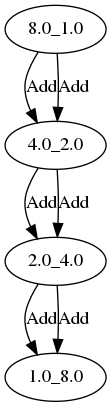
  
  - Matrix Tracing
  
    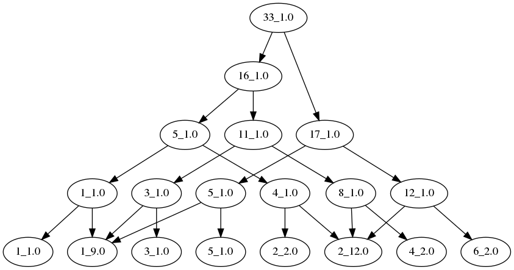
    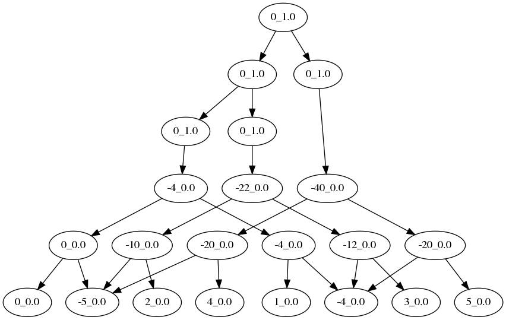
  
  - FNN Tracing
  
    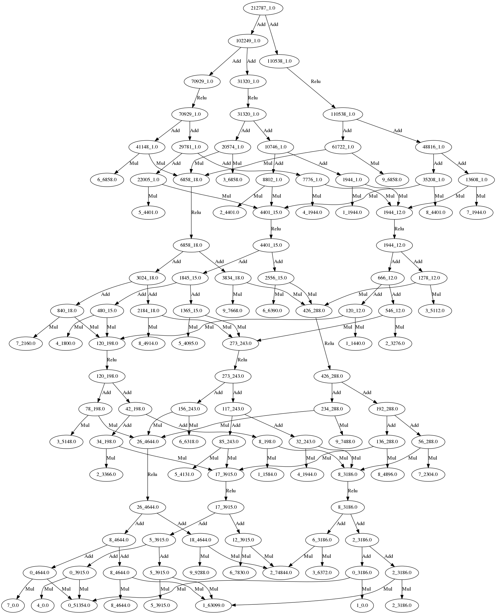

### DYNAMIC
  - Mul\Add\Minus Tracing

   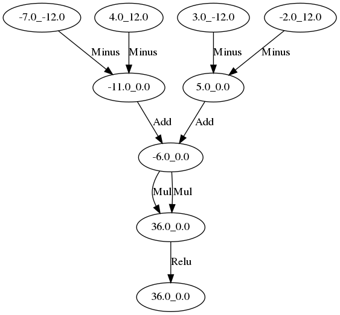

  - Dropout Tracing

   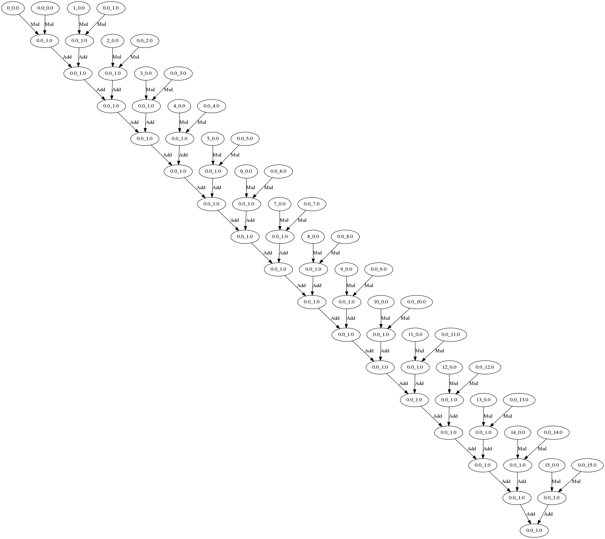

  - MaxPool Tracing

   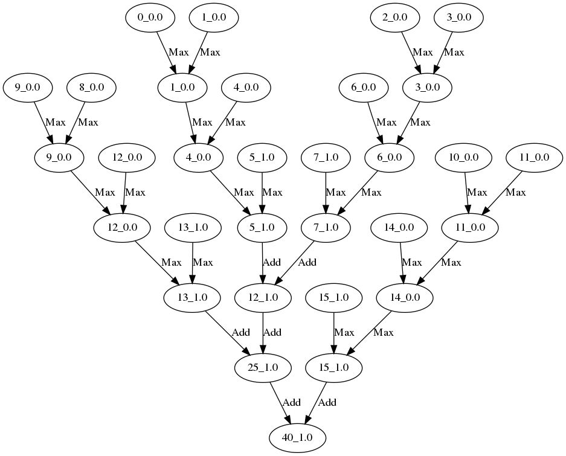

  - MaxPool Tracing

   

  - Relu Tracing 
   
   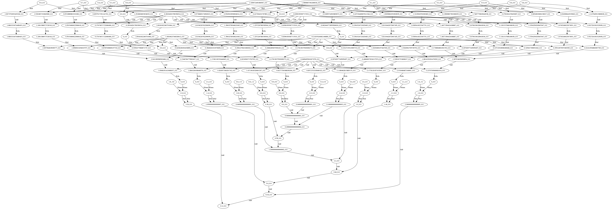

### NumpyNN
   It has not been completed.

## 01-floatflow(November 10, 2021)
   Minimalist demo for implementing parameter servers

   Understand the training framework of deep learning neural networks through approximately 300 lines of C++ code

   ### test_linearEquation
    Solve equation 0.3*x + 0.4 = 0.8

   ## test_equation
    Solve equation 0.3*x^2 + 0.4*x + 0.5 = 0.8 

   ## test_linearFit2
    Linear fitting  a*x + b = y
    
## 02-floatflow_rs(Apr 7, 2023)
   floatflow implemented with Rust language, in order to taste Rust

## 03-dag_executor
   Used to understand the following questions:

      1. How to automatically construct a computational graph for backward calculation of backpropagation algorithm?
      
      2. How to automatically explore the parallelism of computational graphs?

      3. How can computational graphs be viewed as directed acyclic graphs to schedule the execution of computational graphs?

   - Vector self multiplication 
      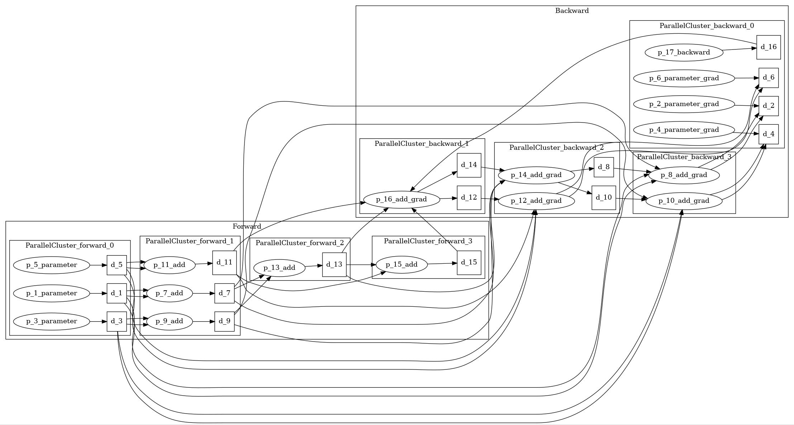
   - Matrix-Vector multiplication
      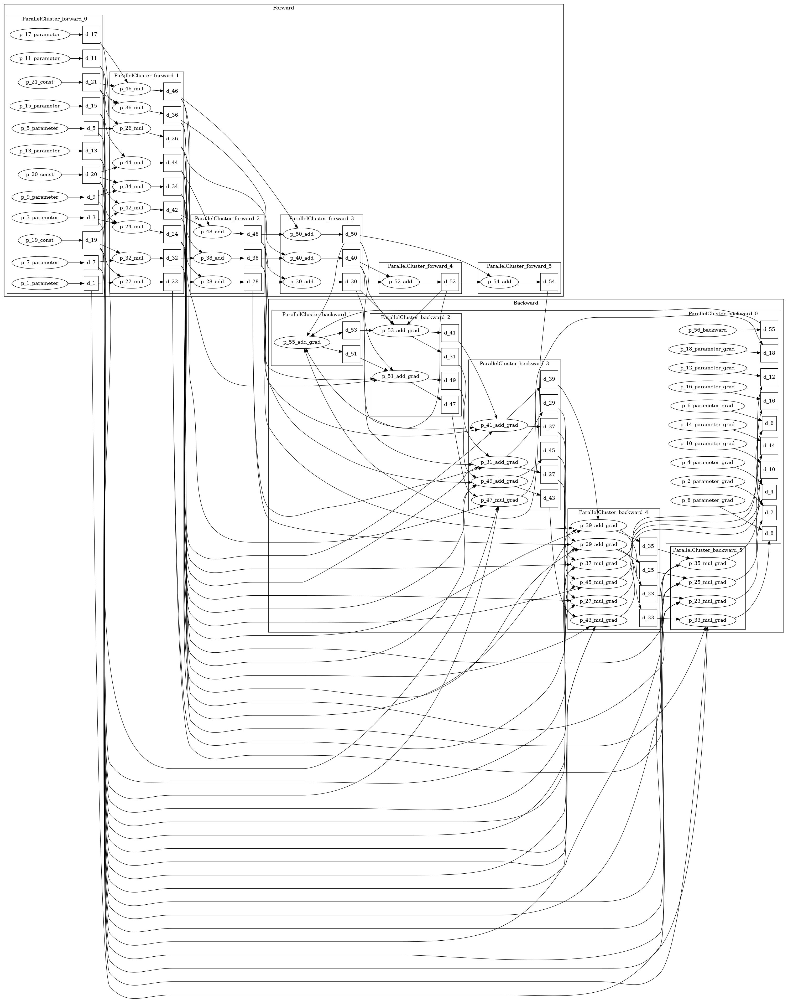
   - FNN 
      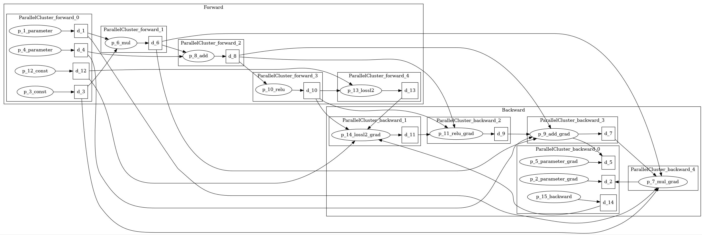
   - High level view of Autoregressive a.k.a RNN
      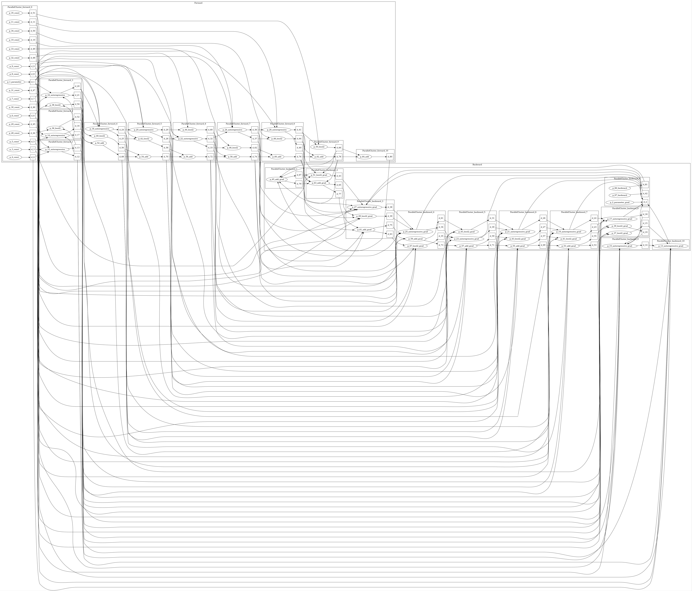
   - Detailed view of Autoregressive a.k. RNN
      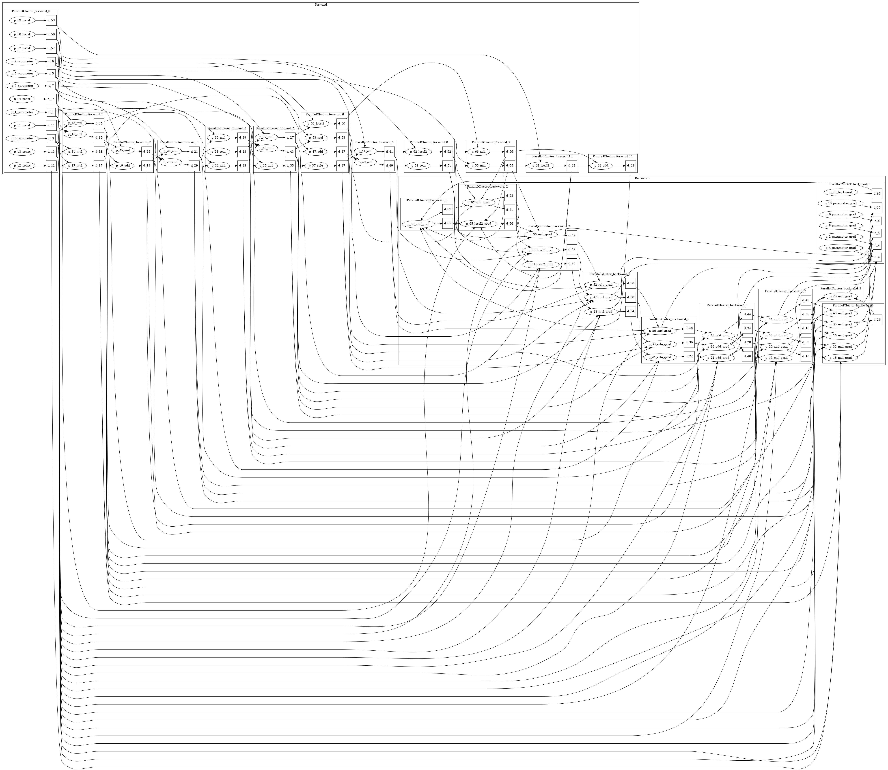